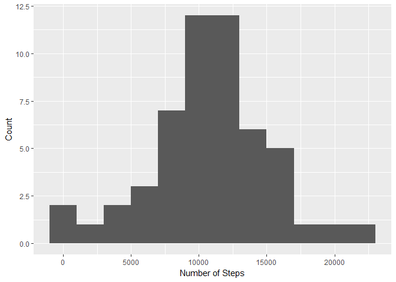
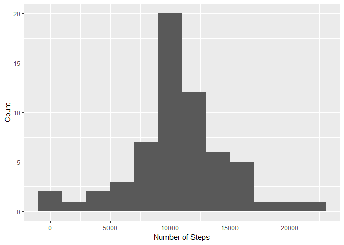
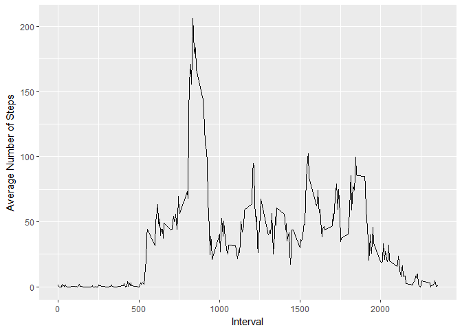
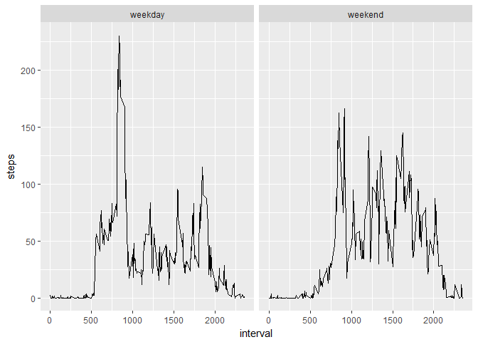

# Activity Monitoring
Dominik Sudwischer  
27 October 2017  


## Preface
This is my solution to the first assignment in the Reproducible Research course by the Johns Hopkins University offered at Coursera. We will consider activity data from an anonymous volunteer who provided step counter data over the course of two months (10/2012 and 11/2011). The data shows the total number of steps for each 5 minute interval (i.e. interval 0 means 00:00 - 00:05 past midnight etc.). Some data is missing. First, we will simply ignore missing data. Second, we will use a very simple approach to fill in missing data and compare mean and median step counts by interval. Finally, we will oppose time series plots for weekdays and weekends respectively.

Please note that the scope of this assignment does not include any inferential analysis. Also, at the moment of writing, my experience with plotting in R is limited, so the plots will be minimalistic.

## Loading the Data and Computing Total Steps per Day
The used libraries are dplyr, ggplot2 and hashmap.

```r
library(ggplot2)
library(hashmap)
```

```
## Warning: package 'hashmap' was built under R version 3.4.2
```

```r
library(dplyr)
```
We will begin by loading the data and looking and having a quick glance at the overview. 

```r
df <- read.csv("activity.csv")
summary(df)
```

```
##      steps                date          interval     
##  Min.   :  0.00   2012-10-01:  288   Min.   :   0.0  
##  1st Qu.:  0.00   2012-10-02:  288   1st Qu.: 588.8  
##  Median :  0.00   2012-10-03:  288   Median :1177.5  
##  Mean   : 37.38   2012-10-04:  288   Mean   :1177.5  
##  3rd Qu.: 12.00   2012-10-05:  288   3rd Qu.:1766.2  
##  Max.   :806.00   2012-10-06:  288   Max.   :2355.0  
##  NA's   :2304     (Other)   :15840
```
As we can see, there is a large number of NA values that we will take care of in a later step. Next, we will introduce two helper functions we will use throughout this document.

```r
sum_steps <- function(input_df)
{
  output_df <- input_df[, c(1, 2)] %>% group_by(date) %>% summarise_all(funs(sum), na.rm = TRUE)
  colnames(output_df) = c("date", "number_of_steps")
  output_df
}
day_classification <- function(date)
{
  day_number <- as.POSIXlt(date)$wday
  if(day_number <= 0 || day_number >= 6)
  {
    "weekend"
  }
  else
  {
    "weekday"
  }
}
```
These functions will help calculate the total number of steps per day and classify each day as either a weekday or a weekend day.
Next, we will group the steps by date and sum them up. A histogram shows the data.

```r
total_steps_per_day <- sum_steps(df)
colnames(total_steps_per_day) = c("date", "number_of_steps")
g <- ggplot(total_steps_per_day, aes(total_steps_per_day$number_of_steps))
g + geom_histogram(binwidth = 2000) + labs(x = "Number of Steps", y = "Count")
```

<!-- -->
The mean and median number of steps taken per day are as follows:

```r
mean(total_steps_per_day$number_of_steps, na.rm = TRUE)
```

```
## [1] 9354.23
```

```r
median(total_steps_per_day$number_of_steps, na.rm = TRUE)
```

```
## [1] 10395
```

## The Average Daily Activity Pattern
We can inspect the average daily activity pattern by drawing a plot of the corresponding time series. We prepare the data by grouping by interval and calculate the mean number of steps taken. A simple line plot suffices to show the relation between the 5-minute-interval (x-axis) and the average number of steps taken in this interval (y-axis).

```r
average_per_interval <- df[, c(1, 3)] %>% group_by(interval) %>% summarise_all(funs(mean), na.rm = TRUE)
colnames(average_per_interval) = c("Interval", "Mean_Steps")
g <- ggplot(average_per_interval, aes(average_per_interval$Interval, average_per_interval$Mean_Steps))
g + geom_line() + labs(x = "Interval", y = "Average Number of Steps")
```

<!-- -->
The maximum number of steps seems to be somewhere around 8:00 a.m. but we will extract the exact interval using R:

```r
average_per_interval$Interval[which.max(average_per_interval$Mean_Steps)]
```

```
## [1] 835
```
Indeed, most steps are taken between 08:35 and 08:40 am. Perhaps the individual goes running before work.

## Replacing Missing Values
We will continue by replacing the NA values in the dataset. Since no sophisticated replacement method is demanded, we will use a simple approach and replace values by averages. To account for trends, an alternative approach like using exponentially weighted averages could be chosen.
In our attempt to replace missing values, we will calculate the average number of steps per interval and replace missing values with that specific average. To access the average value for every single interval, we use a hashmap.

```r
mean_steps <- hashmap(average_per_interval$Interval, round(average_per_interval$Mean_Steps))
df_no_missing <- cbind(df)
for (i in 1:dim(df_no_missing)[1])
{
  if(is.na(df_no_missing[i, "steps"]))
  {
    df_no_missing[i, "steps"] = mean_steps[[df_no_missing[i, "interval"]]]
  }
}
```
Before we continue, let us check if all missing values are replaced.

```r
sapply(df_no_missing, function(x) sum(is.na(x)))
```

```
##    steps     date interval 
##        0        0        0
```
Indeed, our approach successfully removed all missing values.

## Repeating the Analysis with the Modified Data
Using the manipulated data, we can repeat our previous operations with the new dataset.

```r
total_steps_per_day_no_missing <- sum_steps(df_no_missing)
mean(total_steps_per_day_no_missing$number_of_steps, na.rm = TRUE)
```

```
## [1] 10765.64
```

```r
median(total_steps_per_day_no_missing$number_of_steps, na.rm = TRUE)
```

```
## [1] 10762
```

```r
g <- ggplot(total_steps_per_day_no_missing, aes(total_steps_per_day_no_missing$number_of_steps))
g + geom_histogram(binwidth = 2000) + labs(x = "Number of Steps", y = "Count")
```

<!-- -->

```r
g <- ggplot(average_per_interval, aes(average_per_interval$Interval, average_per_interval$Mean_Steps))
g + geom_line() + labs(x = "Interval", y = "Average Number of Steps")
```

<!-- -->
As we can observe, the mean value hasincreased significantly while the new median is comparable to the old value. In this case, the difference between median and mean has shrunken, removing a bit of the skew of the data. 

## Differences Between Activity Patterns on Weekdays and Weekends
We conclude with a final data manipulation to visualize differences in the activity pattern between weekends and weekdays. First, we introduce a factor variable to indicate whether a given record represents a weekday or is in the weekend. Further, we implement group the data by this factor and interval and calculate the arithmetic mean.

```r
df_no_missing$day_class <- as.factor(sapply(X = df_no_missing$date, FUN = day_classification))
mean_per_interval_per_dayclass <- df_no_missing[, c(1, 3, 4)] %>% group_by(interval, day_class) %>% summarise_all(funs(mean), na.rm = TRUE)
```
The resulting data can be visualized in a panel plot to emphasise the differences between weekdays and weekends.

```r
qplot(interval, steps, data = mean_per_interval_per_dayclass, facets = ~day_class, geom = "line")
```

<!-- -->

To finalise the assignment, we observe that the activity during office hours is far lower on weekdays than on weekends. Also, in the morning, the number of steps is significantly lower.
