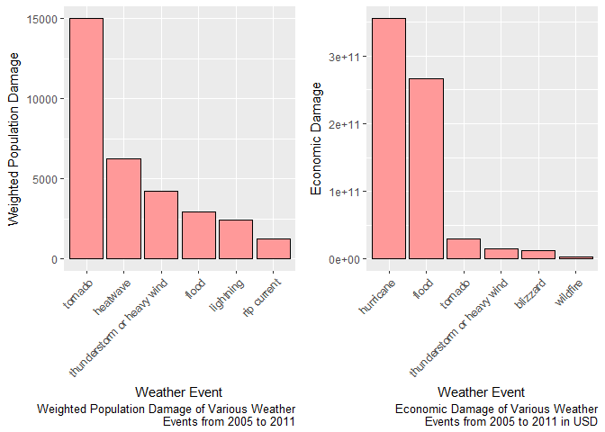
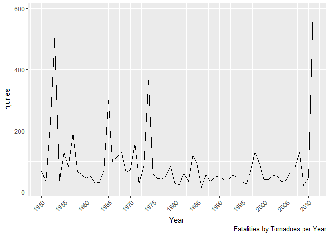

# Effects of Storms in the United States on Population Health and Economy
Dominik Sudwischer  
29 October 2017  


## Synopsis
This analysis examines the U.S. National Oceanic and Atmospheric Administration's (NOAA) storm database. This database contains records of storms and related weather events in the United States including estimations of caused damage. The damage can be categorized in two groups: population health damage such as injuries or fatalities and economic damage like destruction of property. Our main goal is to analyse which type of events were most dangerous to each of the two categories during the years from 2005 through 2011. Our analysis will show that the top 3 hazards with direct health impact are tornadoes, excessive heat and thunderstorms while the destructive force of hurricanes, flood and - to much less extent - tornadoes and thunderstorms caused the majority of economic damage.

## Used Packages
The following packages will be used in this report:

```r
library(lubridate)
```

```
## 
## Attaching package: 'lubridate'
```

```
## The following object is masked from 'package:base':
## 
##     date
```

```r
library(dplyr)
```

```
## 
## Attaching package: 'dplyr'
```

```
## The following objects are masked from 'package:lubridate':
## 
##     intersect, setdiff, union
```

```
## The following objects are masked from 'package:stats':
## 
##     filter, lag
```

```
## The following objects are masked from 'package:base':
## 
##     intersect, setdiff, setequal, union
```

```r
library(ggplot2)
```

## Data Processing
We start by loading the provided file from the NOAA which contains records from 1950 to 2011.

```r
df <- read.csv("repdata%2Fdata%2FStormData.csv.bz2")
summary(df)
```

```
##     STATE__                  BGN_DATE             BGN_TIME     
##  Min.   : 1.0   5/25/2011 0:00:00:  1202   12:00:00 AM: 10163  
##  1st Qu.:19.0   4/27/2011 0:00:00:  1193   06:00:00 PM:  7350  
##  Median :30.0   6/9/2011 0:00:00 :  1030   04:00:00 PM:  7261  
##  Mean   :31.2   5/30/2004 0:00:00:  1016   05:00:00 PM:  6891  
##  3rd Qu.:45.0   4/4/2011 0:00:00 :  1009   12:00:00 PM:  6703  
##  Max.   :95.0   4/2/2006 0:00:00 :   981   03:00:00 PM:  6700  
##                 (Other)          :895866   (Other)    :857229  
##    TIME_ZONE          COUNTY           COUNTYNAME         STATE       
##  CST    :547493   Min.   :  0.0   JEFFERSON :  7840   TX     : 83728  
##  EST    :245558   1st Qu.: 31.0   WASHINGTON:  7603   KS     : 53440  
##  MST    : 68390   Median : 75.0   JACKSON   :  6660   OK     : 46802  
##  PST    : 28302   Mean   :100.6   FRANKLIN  :  6256   MO     : 35648  
##  AST    :  6360   3rd Qu.:131.0   LINCOLN   :  5937   IA     : 31069  
##  HST    :  2563   Max.   :873.0   MADISON   :  5632   NE     : 30271  
##  (Other):  3631                   (Other)   :862369   (Other):621339  
##                EVTYPE         BGN_RANGE           BGN_AZI      
##  HAIL             :288661   Min.   :   0.000          :547332  
##  TSTM WIND        :219940   1st Qu.:   0.000   N      : 86752  
##  THUNDERSTORM WIND: 82563   Median :   0.000   W      : 38446  
##  TORNADO          : 60652   Mean   :   1.484   S      : 37558  
##  FLASH FLOOD      : 54277   3rd Qu.:   1.000   E      : 33178  
##  FLOOD            : 25326   Max.   :3749.000   NW     : 24041  
##  (Other)          :170878                      (Other):134990  
##          BGN_LOCATI                  END_DATE             END_TIME     
##               :287743                    :243411              :238978  
##  COUNTYWIDE   : 19680   4/27/2011 0:00:00:  1214   06:00:00 PM:  9802  
##  Countywide   :   993   5/25/2011 0:00:00:  1196   05:00:00 PM:  8314  
##  SPRINGFIELD  :   843   6/9/2011 0:00:00 :  1021   04:00:00 PM:  8104  
##  SOUTH PORTION:   810   4/4/2011 0:00:00 :  1007   12:00:00 PM:  7483  
##  NORTH PORTION:   784   5/30/2004 0:00:00:   998   11:59:00 PM:  7184  
##  (Other)      :591444   (Other)          :653450   (Other)    :622432  
##    COUNTY_END COUNTYENDN       END_RANGE           END_AZI      
##  Min.   :0    Mode:logical   Min.   :  0.0000          :724837  
##  1st Qu.:0    NA's:902297    1st Qu.:  0.0000   N      : 28082  
##  Median :0                   Median :  0.0000   S      : 22510  
##  Mean   :0                   Mean   :  0.9862   W      : 20119  
##  3rd Qu.:0                   3rd Qu.:  0.0000   E      : 20047  
##  Max.   :0                   Max.   :925.0000   NE     : 14606  
##                                                 (Other): 72096  
##            END_LOCATI         LENGTH              WIDTH         
##                 :499225   Min.   :   0.0000   Min.   :   0.000  
##  COUNTYWIDE     : 19731   1st Qu.:   0.0000   1st Qu.:   0.000  
##  SOUTH PORTION  :   833   Median :   0.0000   Median :   0.000  
##  NORTH PORTION  :   780   Mean   :   0.2301   Mean   :   7.503  
##  CENTRAL PORTION:   617   3rd Qu.:   0.0000   3rd Qu.:   0.000  
##  SPRINGFIELD    :   575   Max.   :2315.0000   Max.   :4400.000  
##  (Other)        :380536                                         
##        F               MAG            FATALITIES          INJURIES        
##  Min.   :0.0      Min.   :    0.0   Min.   :  0.0000   Min.   :   0.0000  
##  1st Qu.:0.0      1st Qu.:    0.0   1st Qu.:  0.0000   1st Qu.:   0.0000  
##  Median :1.0      Median :   50.0   Median :  0.0000   Median :   0.0000  
##  Mean   :0.9      Mean   :   46.9   Mean   :  0.0168   Mean   :   0.1557  
##  3rd Qu.:1.0      3rd Qu.:   75.0   3rd Qu.:  0.0000   3rd Qu.:   0.0000  
##  Max.   :5.0      Max.   :22000.0   Max.   :583.0000   Max.   :1700.0000  
##  NA's   :843563                                                           
##     PROPDMG          PROPDMGEXP        CROPDMG          CROPDMGEXP    
##  Min.   :   0.00          :465934   Min.   :  0.000          :618413  
##  1st Qu.:   0.00   K      :424665   1st Qu.:  0.000   K      :281832  
##  Median :   0.00   M      : 11330   Median :  0.000   M      :  1994  
##  Mean   :  12.06   0      :   216   Mean   :  1.527   k      :    21  
##  3rd Qu.:   0.50   B      :    40   3rd Qu.:  0.000   0      :    19  
##  Max.   :5000.00   5      :    28   Max.   :990.000   B      :     9  
##                    (Other):    84                     (Other):     9  
##       WFO                                       STATEOFFIC    
##         :142069                                      :248769  
##  OUN    : 17393   TEXAS, North                       : 12193  
##  JAN    : 13889   ARKANSAS, Central and North Central: 11738  
##  LWX    : 13174   IOWA, Central                      : 11345  
##  PHI    : 12551   KANSAS, Southwest                  : 11212  
##  TSA    : 12483   GEORGIA, North and Central         : 11120  
##  (Other):690738   (Other)                            :595920  
##                                                                                                                                                                                                     ZONENAMES     
##                                                                                                                                                                                                          :594029  
##                                                                                                                                                                                                          :205988  
##  GREATER RENO / CARSON CITY / M - GREATER RENO / CARSON CITY / M                                                                                                                                         :   639  
##  GREATER LAKE TAHOE AREA - GREATER LAKE TAHOE AREA                                                                                                                                                       :   592  
##  JEFFERSON - JEFFERSON                                                                                                                                                                                   :   303  
##  MADISON - MADISON                                                                                                                                                                                       :   302  
##  (Other)                                                                                                                                                                                                 :100444  
##     LATITUDE      LONGITUDE        LATITUDE_E     LONGITUDE_    
##  Min.   :   0   Min.   :-14451   Min.   :   0   Min.   :-14455  
##  1st Qu.:2802   1st Qu.:  7247   1st Qu.:   0   1st Qu.:     0  
##  Median :3540   Median :  8707   Median :   0   Median :     0  
##  Mean   :2875   Mean   :  6940   Mean   :1452   Mean   :  3509  
##  3rd Qu.:4019   3rd Qu.:  9605   3rd Qu.:3549   3rd Qu.:  8735  
##  Max.   :9706   Max.   : 17124   Max.   :9706   Max.   :106220  
##  NA's   :47                      NA's   :40                     
##                                            REMARKS           REFNUM      
##                                                :287433   Min.   :     1  
##                                                : 24013   1st Qu.:225575  
##  Trees down.\n                                 :  1110   Median :451149  
##  Several trees were blown down.\n              :   568   Mean   :451149  
##  Trees were downed.\n                          :   446   3rd Qu.:676723  
##  Large trees and power lines were blown down.\n:   432   Max.   :902297  
##  (Other)                                       :588295
```
The data contains more than 900000 observations with 37 variables in total. 
The event type is stored as a factor in the "EVTYPE" column and has 985 levels, some of which indicate summaries and some of which still have to be combined. We will investigate which events are the most hazardous in terms of health damage or property damage.

The data is a bit unclean, so we will need to do some work before can we can analyse the data. We start with transforming letters to lower case in columns describing the events and columns specifying damage multipliers (the "...exp" columns with factors like "M", "k" and so on).


```r
df[, c("CROPDMGEXP", "PROPDMGEXP", "EVTYPE")] <-
  data.frame(sapply(df[, c("CROPDMGEXP", "PROPDMGEXP", "EVTYPE")], tolower))
unique(df$CROPDMGEXP)
```

```
## [1]   m k b ? 0 2
## Levels:  ? 0 2 b k m
```

```r
unique(df$PROPDMGEXP)
```

```
##  [1] k m   b + 0 5 6 ? 4 2 3 h 7 - 1 8
## Levels:  - ? + 0 1 2 3 4 5 6 7 8 b h k m
```

The data "exp" columns indicate the power of 10 that should be multiplied with the number in the actual damage column. The values "?", "+" and "-" are not usable because they do not clearly state what they stand for, so we will remove those lines. A blank entry corresponds to the factor 1 (or the exponent 0). Other than that, "b" (billion) is 10^9, "m" (mega) is 10^6, "k" (kilo) is 10^3 and "h" (hecto) is 10^2. We will add a new column, "TOTALECONDMG", by multiplying crop and property damage by their respective factors and adding them.


```r
selection <- !((df$CROPDMGEXP %in% c("+", "-", "?")) |
                 (df$PROPDMGEXP %in% c("+", "-", "?")))
df <- df[selection, ]
df$PROPDMGFACTOR <- 1
df$PROPDMGFACTOR[df$PROPDMGEXP == "h"] <- 100
df$PROPDMGFACTOR[df$PROPDMGEXP == "k"] <- 1000
df$PROPDMGFACTOR[df$PROPDMGEXP == "m"] <- 1000000
df$PROPDMGFACTOR[df$PROPDMGEXP == "b"] <- 1000000000
selection <- !is.na(as.numeric(df$PROPDMGEXP))
df$CROPDMGFACTOR[selection] <- 10^as.numeric(df$CROPDMGEXP[selection])
df$CROPDMGFACTOR <- 1
df$CROPDMGFACTOR[df$CROPDMGEXP == "h"] <- 100
df$CROPDMGFACTOR[df$CROPDMGEXP == "k"] <- 1000
df$CROPDMGFACTOR[df$CROPDMGEXP == "m"] <- 1000000
df$CROPDMGFACTOR[df$CROPDMGEXP == "b"] <- 1000000000
selection <- !is.na(as.numeric(df$CROPDMGEXP))
df$CROPDMGFACTOR[selection] <- 10^as.numeric(df$CROPDMGEXP[selection])
df$TOTALECONDMG <- as.numeric(df$CROPDMG) *
  as.numeric(df$PROPDMGFACTOR) +
  as.numeric(df$PROPDMG) *
  as.numeric(df$PROPDMGFACTOR)
```

Now that we have useful data for economic damage, we will clean the event descriptions. The data uses different words for similar weather events such as "very dry" and "drought". We will consolidate the data a bit. However, since there are 985 different factor levels, a very sophisticated method for consolidation is difficult to develop and beyond the scope of this report. Instead we will use a simpler method.


```r
consolidate <- function(event)
{
  if(grepl("hurricane|typhoon|cyclone", event))
  { "hurricane" }
  else if(grepl("tornado", event))
    { "tornado" }
  else if(grepl("drought|dry|hot|heat|warm|high temp|warmth", event))
    { "heatwave" }
  else if(grepl("blizzard|hail|snow|glaze", event))
    { "blizzard" }
  else if(grepl("tstm|thunderstorm|wind", event))
    { "thunderstorm or heavy wind" }
  else if(grepl("rain|wet", event))
    { "rainfall" }
  else if(grepl("ice|icy|cold|low temp|freez", event))
  { "low temperature" }
  else if(grepl("flood|surge", event))
    { "flood" }
  else { event }
}
```

We can now modify the event column using this function.

```r
df$EVTYPE <- as.factor(sapply(as.character(df$EVTYPE), consolidate))
```

We will focus our research to work with recent calamities, considering only data from 2005 up to 2011. For this reason, we will begin with a suitable date conversion of the BGN_DATE column.

```r
df$YEAR <- year(as.Date.character(df$BGN_DATE, format = "%m/%d/%Y"))
```
### Selecting a Suitable Subset of the Data
We will create a copy of our original data frame that only contains a subset of the records, in particular it will comprise all records from 2005 through 2011.

```r
records <- df[df$YEAR >= 2005, ]
```
As we can see, we selected a bit more than a third of the original data set. The density of reports and the recent years has inceased drastically, so it is natural that a small subset of the most recent observed years contains a large proportion of the records.

We will need to observe economic and health damage seperately, so we will split our data accordingly.
### Splitting the Data for Further Analysis

```r
health_df <- records[, c("INJURIES", "FATALITIES", "EVTYPE")]
econ_df <- records[, c("TOTALECONDMG", "EVTYPE")]
```
Next, we check our subset of the data for missing values.

```r
sum(matrix(data = is.na(health_df), ncol = 1))
```

```
## [1] 0
```

```r
sum(matrix(data = is.na(econ_df), ncol = 1))
```

```
## [1] 0
```
Neither of our data frames have NA values, so we can continue analysing the data. We will begin with the health data by grouping by event and summing up injuries and fatalities. We will also introduce a variable called "DAMAGE" which is the weighted sum of injuries (with factor 1) and fatalities (with factor 4). Additionally, we will sort the data by this new column in descending order.

```r
health_df_agg <- health_df[, c("INJURIES", "FATALITIES")] %>%
  group_by(health_df$EVTYPE) %>% summarise_all(funs(sum))
health_df_agg$DAMAGE = health_df_agg$INJURIES + 4 * health_df_agg$FATALITIES
health_df_agg <- health_df_agg[order(-health_df_agg$DAMAGE, -health_df_agg$FATALITIES), ]
colnames(health_df_agg)[1] = "EVTYPE"
```
We will do the same for recorded cases of economic damage.

```r
econ_df_agg <- econ_df %>% group_by(econ_df$EVTYPE) %>%
  summarise(TOTALECONDMG = sum(TOTALECONDMG))
econ_df_agg <- econ_df_agg[order(-econ_df_agg$TOTALECONDMG), ]
colnames(econ_df_agg)[1] = "EVTYPE"
```

## Results
In this section, we will use the multiplot function. The code and the source can be found in the appendix.


The preparations performed above allow us to generate insights from the data. We will begin with a bar plot of the 6 top hazards for health and for the economy. 

```r
g <- ggplot(data=head(health_df_agg), aes(reorder(EVTYPE, -DAMAGE), DAMAGE)) +
  geom_bar(stat = "identity", fill="#FF9999", color = "black") + 
  labs(x = "Weather Event", y = "Weighted Population Damage",
       caption = "Weighted Population Damage of Various Weather\nEvents from 2005 to 2011") + 
  #ggtitle("Weighted Population Damage of Various Weather Events from 2005 to 2011") + 
  theme(axis.text.x = element_text(angle = 45, hjust = 1))
h <- ggplot(data=head(econ_df_agg), aes(reorder(EVTYPE, -TOTALECONDMG), TOTALECONDMG)) +
  geom_bar(stat = "identity", fill="#FF9999", color = "black") + 
  labs(x = "Weather Event", y = "Economic Damage",
       caption = "Economic Damage of Various Weather\nEvents from 2005 to 2011 in USD") + 
  #ggtitle("Economic Damage of Various Weather Events from 2005 to 2011") + 
  theme(axis.text.x = element_text(angle = 45, hjust = 1))
multiplot(g, h, cols = 2)
```

<!-- -->

We can easily see that hurricanes have a tremendous impact on health according to our weighted damage, followed by excessive heat and thunderstorms with much lower numbers. In particular, the numbers of injuries and fatalities due to the 3 most dangerous hazards is as follows:

```r
health_df_agg[health_df_agg$EVTYPE %in% c("tornado", "heatwave",
                                          "thunderstorm or heavy wind"), ]
```

```
## # A tibble: 3 x 4
##                       EVTYPE INJURIES FATALITIES DAMAGE
##                       <fctr>    <dbl>      <dbl>  <dbl>
## 1                    tornado    11137        968  15009
## 2                   heatwave     3397        711   6241
## 3 thunderstorm or heavy wind     2283        486   4227
```

As for economic damage, hurricanes cause enormous damage as well. Second to them are only flood and far, far behind tornadoes and thunderstorms. The numbers can be seen below:

```r
econ_df_agg[econ_df_agg$EVTYPE %in% c("hurricane", "flood", "tornado", "thunderstorm or heavy wind"), ]
```

```
## # A tibble: 4 x 2
##                       EVTYPE TOTALECONDMG
##                       <fctr>        <dbl>
## 1                  hurricane 355336906330
## 2                      flood 266995036151
## 3                    tornado  29057210037
## 4 thunderstorm or heavy wind  15045093540
```

Finally, we will have a glance at the trend for fatalities by tornadoes since the beginning of the observations.

```r
tornado_data <- df[df$EVTYPE == "tornado", c("FATALITIES", "YEAR")]
tornado_data <- tornado_data %>% group_by(tornado_data$YEAR) %>%
  summarise(SUM_FATALITIES = sum(FATALITIES))
colnames(tornado_data)[1] = "YEAR"
g <- ggplot(data=tornado_data, aes(YEAR)) +
  geom_line(aes(y = tornado_data$SUM_FATALITIES)) + 
  scale_x_continuous(breaks = seq(1950, 2011, 5), "Year") +
  labs(x = "Year", y = "Injuries",
       caption = "Fatalities by Tornadoes per Year") + 
  theme(axis.text.x = element_text(angle = 45, hjust = 1))
g
```

<!-- -->

As we can see, there are some spikes in the data corresponding to extraordinarily threatening tornadoes.

We conclude our analysis with the remark that the most dangerous hazards for population health are indeed tornadoes, excessive heat and thunderstorms. The most economic damage is caused by hurricanes and flood.

## Appendix
This is the definition of the multiplot function. [Source][1]:

```r
# Multiple plot function
#
# ggplot objects can be passed in ..., or to plotlist (as a list of ggplot objects)
# - cols:   Number of columns in layout
# - layout: A matrix specifying the layout. If present, 'cols' is ignored.
#
# If the layout is something like matrix(c(1,2,3,3), nrow=2, byrow=TRUE),
# then plot 1 will go in the upper left, 2 will go in the upper right, and
# 3 will go all the way across the bottom.
#
multiplot <- function(..., plotlist=NULL, file, cols=1, layout=NULL) {
  library(grid)

  # Make a list from the ... arguments and plotlist
  plots <- c(list(...), plotlist)

  numPlots = length(plots)

  # If layout is NULL, then use 'cols' to determine layout
  if (is.null(layout)) {
    # Make the panel
    # ncol: Number of columns of plots
    # nrow: Number of rows needed, calculated from # of cols
    layout <- matrix(seq(1, cols * ceiling(numPlots/cols)),
                    ncol = cols, nrow = ceiling(numPlots/cols))
  }

 if (numPlots==1) {
    print(plots[[1]])

  } else {
    # Set up the page
    grid.newpage()
    pushViewport(viewport(layout = grid.layout(nrow(layout), ncol(layout))))

    # Make each plot, in the correct location
    for (i in 1:numPlots) {
      # Get the i,j matrix positions of the regions that contain this subplot
      matchidx <- as.data.frame(which(layout == i, arr.ind = TRUE))

      print(plots[[i]], vp = viewport(layout.pos.row = matchidx$row,
                                      layout.pos.col = matchidx$col))
    }
  }
}
```
[1]: http://www.cookbook-r.com/Graphs/Multiple_graphs_on_one_page_(ggplot2)
